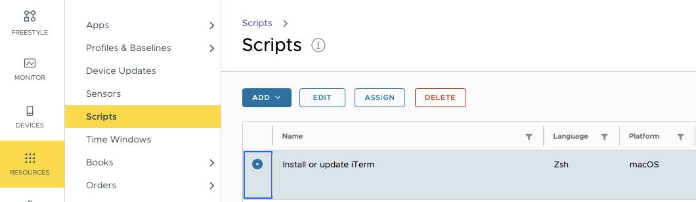
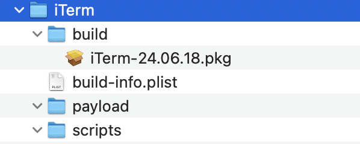
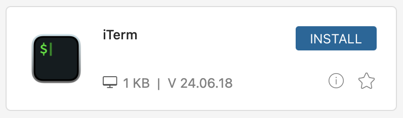

# Documentation for using Installomator in WorkspaceONE UEM


Table of contents:

- [Documentation for using Installomator in WorkspaceONE UEM](#documentation-for-using-installomator-in-workspaceone-uem)
- [Introduction](#introduction)
- [Building Block : install Installomator](#building-block--install-installomator)
- [Choice : use Script or App?](#choice--use-script-or-app)
- [Option 1 - Script](#option-1---script)
	- [Hub view of script](#hub-view-of-script)
	- [troubleshoot script installation](#troubleshoot-script-installation)
- [Option 2 - Internal App](#option-2---internal-app)
	- [create payload-free pkg](#create-payload-free-pkg)
	- [Create app with payload-free pkg in WSO](#create-app-with-payload-free-pkg-in-wso)
	- [Hub view of app](#hub-view-of-app)
	- [Troubleshooting app installation](#troubleshooting-app-installation)
- [Versioning system with payload-free pkg](#versioning-system-with-payload-free-pkg)
- [recommendations for your choice script or app](#recommendations-for-your-choice-script-or-app)
- [Note on patch management for WSO and Installomator](#note-on-patch-management-for-wso-and-installomator)
- [Links](#links)


# Introduction
WorkspaceONE UEM (in short WSO) has in some regards a different approach to install and update software than other MDM's.
Main points which effect the use of Installomator are:
- WSO cannot handle large scripts (i.e. Installomator), so you need to install Installomator locally.
- Patch management for 'internal' apps is based on version as installated by WSO. (Not on version found on the Mac)

This means that if you install apps with Installomator, you have to manage your app's updates with a custom solution (which can be Installomator based :-)

# Building Block : install Installomator
Because we have to get Installomator on the Mac, the easiest solution is to use the ready made .pkg from Installomator project, and distribute that to all Mac's as a 'bootstrap package'. Advantage: this gets installed first during enrollment.

*In our org we deploy Installomator as bootstrap pkg, but since our org prefers local language, we distribute an updated version of Installomator with some translations and different defaults as a sub-version i.e. 10.5.3*

Since Installomator is installed locally, all we need to run on the Mac is a short script with this command:

```
/usr/local/Installomator/Installomator.sh iterm2
```

*(you can get wild with options, we leave that up to you)*

How can we present this script to the user or make WSO run this script?

# Choice : use Script or App?

To make icons available in the Hub for Self-Service you can add a **script** or an **internal App** to the Hub. 

We will show both options and discuss differences later.

# Option 1 - Script
Scripts can be run at specific moments, or on-demand from the Hub, with icon, description.
If you add a script to the Hub for self-service, the button is 'Run/Rerun'


Navigate to you WSO portal to the Resources - Scripts section 

 click  **Add** a script for macOS :

Choose a name, Description and enable App Catalog Customisation, add logo similar to this:

Click **Next**

Choose Languare **Zsh**, execution context and timeout **120** (tailor to your needs, the default 30 is too short).
Copy the script (example [install-iTerm.sh](wso_scripts/install-iTerm.sh)) similar to this:

Click **Next**

There is no need to use variables. 

Click **Save**

**Re-select** the script to create assignment:

Click **Assign**

Choose a descriptive name, and the correct smart groups similar to this:

Click **Next**

Choose **NO** triggers, but  **enable** Show in Hub (optional)

Click **Add**

Done!

## Hub view of script
Go to a Mac to confirm this script is available in the Hub:
Open Intelligent Hub, and search for your *app-name*

Notice the title, icon and 'Run' button

If you click on the icon you can see the detailed view:

If you click 'Run' you may see a temporary dialog 'Installing ...your_title...' as this:


The app should be installed soon in /Applications/

Note: if you have run the script once, the button changes to 'Rerun'


**Done !**

## troubleshoot script installation
You can troubleshoot in the WSO by searching for the MacBook, and in the **scripts** section you will see the script with a status and last execution time:

view the detailed logs by clicking on the **View** link below Log

The logs are shown as one line. Not great, but the log is readable.

You can troubleshoot on the Mac by inspecting at the Installomator log at `/private/var/log/Installomator.log`


# Option 2 - Internal App

The main technology to install/update 'internal' apps is based on an integrated munki client. With each app WSO can (optionally) run pre- or post-install scripts.

With installomator the install is done by a script, but WSO needs a package to manage the app. Therefor we create a payload-free package with [munkipkg](https://github.com/munki/munki-pkg) with a unique identifier and version. 

## create payload-free pkg
We use munkipkg for this.
Basically you need to do these 3 steps:
1. create a new project with munkipkg:

```
% ./munkipkg.py --create ..path/to../iTerm
```
2. Edit the info.plist and 
* set the **identifier** to my.org.iTerm (best practices to use different identifiers than the real app, to prevent confusion)
* set the **version** to the current date (i.e. 24.06.18)
  
    example: 

 ```
 <?xml version="1.0" encoding="UTF-8"?>
<!DOCTYPE plist PUBLIC "-//Apple//DTD PLIST 1.0//EN" "http://www.apple.com/DTDs/PropertyList-1.0.dtd">
<plist version="1.0">
<dict>
	<key>distribution_style</key>
	<false/>
	<key>identifier</key>
	<string>my.org.iTerm</string>
	<key>install_location</key>
	<string>/</string>
	<key>name</key>
	<string>iTerm-${version}.pkg</string>
	<key>ownership</key>
	<string>recommended</string>
	<key>postinstall_action</key>
	<string>none</string>
	<key>preserve_xattr</key>
	<false/>
	<key>suppress_bundle_relocation</key>
	<true/>
	<key>version</key>
	<string>24.06.18</string>
</dict>
</plist>
```
3. create the pkg with munkipkg:
``` 
% ./munkipkg.py  ..path/to../iTerm
pkgbuild: Inferring bundle components from contents of ..path/to../iTerm/payload
pkgbuild: Writing new component property list to /var/folders/h9/5_fhws_n69504y0p2_yk1tf40000gr/T/tmp2iv56q4f/component.plist
pkgbuild: Reading components from /var/folders/h9/5_fhws_n69504y0p2_yk1tf40000gr/T/tmp2iv56q4f/component.plist
pkgbuild: Wrote package to ..path/to../iTerm/build/iTerm-24.06.18.pkg
```
This should be the iTerm folder structure after this command:


4. Prepare this pkg for WSO with the WorkspaceONE Admin Assistant to create the metadata file and find the icon file.

Output of Admin Assistant is default in your `~/Documents/Workspace ONE Admin Assistant/` folder.


## Create app with payload-free pkg in WSO
Navigate to the Resources - Apps in WSO and add a new app:

Upload the .pkg file from the WSO Admin assistant output.
Click on **Continue**


Select **Full Software Management**

Upload the .plist file from the WSO Admin assistant output as the metadata file.
Click on **Continue**


Review the settings in the Details section

Scroll down and add a Description


Click on the **Images** section

and add the icon file found earlier.

Click on the Scripts section

Copy the (same) script (example [install-iTerm.sh](wso_scripts/install-iTerm.sh)) into the Pre-Install script section.
(we recommend Pre-install to give user faster feedback)

At this point I want to encourage you to scroll down and take a look at the (optional) uninstall script section.

We use the [uninstaller](https://github.com/erikstam/uninstaller) project for many apps. 
*(the iTerm example is poorly choosen, the label iterm2 is not yet supported), but just to show the possibilities it is included*

Click **Save & Assign**

Done!


## Hub view of app
Navigate to the Mac Apps section or search for the app name:

Note the size (payload free is small), and version.

Click on the icon to show all details for the app:

Note the description entered before and the **'Install'** button

Click **Install**

You may notice the short notification:


and the app iTerm should be installed soon.

If you keep the app selected in the Hub notice the change of the buttons:

now **Install** is replaced with **Reinstall** and **Remove**.

Done !

If you would click **Remove**

the app should be removed using the uninstall script.

## Troubleshooting app installation
In UEM you can be surprised to see two verions of the App installed:

Notice the two versions:
One is the app as found by inventory check (3.5.2), the other is the installed (payload-free pkg v24.06.18) by UEM.

*The same behaviour can be seen if the app verions installed by UEM is using its internal update mechanism.*

If you would click on the Managed Apps section, only the payload-free version 24.06.18 would be shown.

Local logs can be found on the Mac in the `/Library/Application Support/AirWatch/Data/Munki/Managed Installs/Logs/ManagedSoftwareUpdate.log`
example of install:
```
Jun 18 2024 21:19:13 +0200     Need to install iTerm
Jun 18 2024 21:19:13 +0200     Downloading iTerm-24.06.18.pkg from iTerm-24.06.18.pkg
Jun 18 2024 21:19:13 +0200     Downloading iTerm-24.06.18.pkg from iTerm-24.06.18.pkg
Jun 18 2024 21:19:15 +0200     Normalized header: {'x-content-type-options': 'nosniff', 'content-type': 'application/data', 'pragma': 'no-cache', 'expires': '-1', 'connection': 'keep-alive', 'accept-ranges': 'bytes', 'date': 'Tue, 18 Jun 2024 19:19:15 GMT', 'x-frame-options': 'SAMEORIGIN', 'content-length': '1462', 'cache-control': 'no-cache', 'etag': '"ac5f214594c1da1:0"'}
Jun 18 2024 21:19:15 +0200     Response has Etag : "ac5f214594c1da1:0"
Jun 18 2024 21:19:15 +0200     Not resuming, just open the file for writing.
Jun 18 2024 21:19:15 +0200     Downloading iTerm-24.06.18.pkg...
Jun 18 2024 21:19:15 +0200     Verifying package integrity...
Jun 18 2024 21:19:15 +0200     **Checking for removals**
Jun 18 2024 21:19:15 +0200     **Checking for managed updates**
Jun 18 2024 21:19:15 +0200 ###    End managed software check    ###
Jun 18 2024 21:19:15 +0200     
Jun 18 2024 21:19:15 +0200     The following items will be installed or upgraded:
Jun 18 2024 21:19:15 +0200         + iTerm-24.06.18
Jun 18 2024 21:19:15 +0200     Preventing idle sleep
Jun 18 2024 21:19:15 +0200 ### Beginning unattended installer session ###
Jun 18 2024 21:19:15 +0200 Processing installs
Jun 18 2024 21:19:15 +0200 Installing iTerm-24.06.18 (1 of 1)
Jun 18 2024 21:19:15 +0200     Running preinstall_script for iTerm
Jun 18 2024 21:19:15 +0200      --> Instal or update iterm2 with Installomator
Jun 18 2024 21:19:15 +0200     2024-06-18 21:19:15 : REQ   : iterm2 : ################## Start Installomator v. 10.5, date 2024-04-29
Jun 18 2024 21:19:15 +0200     2024-06-18 21:19:15 : INFO  : iterm2 : ################## Version: 10.5
Jun 18 2024 21:19:15 +0200     2024-06-18 21:19:15 : INFO  : iterm2 : ################## Date: 2024-04-29
Jun 18 2024 21:19:15 +0200     2024-06-18 21:19:15 : INFO  : iterm2 : ################## iterm2
Jun 18 2024 21:19:15 +0200     2024-06-18 21:19:15 : INFO  : iterm2 : SwiftDialog is not installed, clear cmd file var
Jun 18 2024 21:19:15 +0200     2024-06-18 21:19:15 : INFO  : iterm2 : setting variable from argument LOGO=ws1 NOTIFY=silent BLOCKING_PROCESS_ACTION=prompt_user
Jun 18 2024 21:19:16 +0200     2024-06-18 21:19:16 : INFO  : iterm2 : BLOCKING_PROCESS_ACTION=prompt_user
Jun 18 2024 21:19:16 +0200     2024-06-18 21:19:16 : INFO  : iterm2 : NOTIFY=silent
Jun 18 2024 21:19:16 +0200     2024-06-18 21:19:16 : INFO  : iterm2 : LOGGING=INFO
Jun 18 2024 21:19:16 +0200     2024-06-18 21:19:16 : INFO  : iterm2 : LOGO=/Applications/Workspace ONE Intelligent Hub.app/Contents/Resources/AppIcon.icns
Jun 18 2024 21:19:16 +0200     2024-06-18 21:19:16 : INFO  : iterm2 : Label type: zip
Jun 18 2024 21:19:16 +0200     2024-06-18 21:19:16 : INFO  : iterm2 : archiveName: iTerm.zip
Jun 18 2024 21:19:16 +0200     2024-06-18 21:19:16 : INFO  : iterm2 : name: iTerm, appName: iTerm.app
Jun 18 2024 21:19:16 +0200     2024-06-18 21:19:16.190 mdfind[19062:153678] [UserQueryParser] Loading keywords and predicates for locale "en_US"
Jun 18 2024 21:19:16 +0200     2024-06-18 21:19:16.191 mdfind[19062:153678] [UserQueryParser] Loading keywords and predicates for locale "en"
Jun 18 2024 21:19:16 +0200     2024-06-18 21:19:16.355 mdfind[19062:153678] Couldn't determine the mapping between prefab keywords and predicates.
Jun 18 2024 21:19:16 +0200     2024-06-18 21:19:16 : WARN  : iterm2 : No previous app found
Jun 18 2024 21:19:16 +0200     2024-06-18 21:19:16 : WARN  : iterm2 : could not find iTerm.app
Jun 18 2024 21:19:16 +0200     2024-06-18 21:19:16 : INFO  : iterm2 : appversion:
Jun 18 2024 21:19:16 +0200     2024-06-18 21:19:16 : INFO  : iterm2 : Latest version of iTerm is 3.5.2
Jun 18 2024 21:19:16 +0200     2024-06-18 21:19:16 : REQ   : iterm2 : Downloading https://iterm2.com/downloads/stable/latest to iTerm.zip
Jun 18 2024 21:19:19 +0200     2024-06-18 21:19:19 : REQ   : iterm2 : no more blocking processes, continue with update
Jun 18 2024 21:19:19 +0200     2024-06-18 21:19:19 : REQ   : iterm2 : Installing iTerm
Jun 18 2024 21:19:19 +0200     2024-06-18 21:19:19 : INFO  : iterm2 : Unzipping iTerm.zip
Jun 18 2024 21:19:19 +0200     2024-06-18 21:19:19 : INFO  : iterm2 : Verifying: /var/folders/zz/zyxvpxvq6csfxvn_n0000000000000/T/tmp.kAODkfmXrZ/iTerm.app
Jun 18 2024 21:19:20 +0200     2024-06-18 21:19:20 : INFO  : iterm2 : Team ID matching: H7V7XYVQ7D (expected: H7V7XYVQ7D )
Jun 18 2024 21:19:20 +0200     2024-06-18 21:19:20 : INFO  : iterm2 : Installing iTerm version 3.5.2 on versionKey CFBundleShortVersionString.
Jun 18 2024 21:19:20 +0200     2024-06-18 21:19:20 : INFO  : iterm2 : App has LSMinimumSystemVersion: 10.15
Jun 18 2024 21:19:20 +0200     2024-06-18 21:19:20 : INFO  : iterm2 : Copy /var/folders/zz/zyxvpxvq6csfxvn_n0000000000000/T/tmp.kAODkfmXrZ/iTerm.app to /Applications
Jun 18 2024 21:19:21 +0200     2024-06-18 21:19:21 : WARN  : iterm2 : Changing owner to sandm10
Jun 18 2024 21:19:21 +0200     2024-06-18 21:19:21 : INFO  : iterm2 : Finishing...
Jun 18 2024 21:19:24 +0200     2024-06-18 21:19:24 : INFO  : iterm2 : App(s) found: /Applications/iTerm.app
Jun 18 2024 21:19:24 +0200     2024-06-18 21:19:24 : INFO  : iterm2 : found app at /Applications/iTerm.app, version 3.5.2, on versionKey CFBundleShortVersionString
Jun 18 2024 21:19:24 +0200     2024-06-18 21:19:24 : REQ   : iterm2 : Installed iTerm, version 3.5.2
Jun 18 2024 21:19:24 +0200     2024-06-18 21:19:24 : INFO  : iterm2 : Installomator did not close any apps, so no need to reopen any apps.
Jun 18 2024 21:19:24 +0200     2024-06-18 21:19:24 : REQ   : iterm2 : All done!
Jun 18 2024 21:19:24 +0200     2024-06-18 21:19:24 : REQ   : iterm2 : ################## End Installomator, exit code 0
Jun 18 2024 21:19:24 +0200     
Jun 18 2024 21:19:24 +0200      --> end of script for iterm2 with Installomator
Jun 18 2024 21:19:24 +0200 Running preinstall_script for iTerm was successful.
Jun 18 2024 21:19:24 +0200 Installing iTerm-24.06.18 from iTerm-24.06.18.pkg
Jun 18 2024 21:19:24 +0200  Package name is iTerm-24.06.18
Jun 18 2024 21:19:24 +0200  Upgrading at base path /
Jun 18 2024 21:19:24 +0200     Preparing for installation…
Jun 18 2024 21:19:24 +0200     Preparing the disk…
Jun 18 2024 21:19:24 +0200     Preparing iTerm-24.06.18…
Jun 18 2024 21:19:25 +0200     Waiting for other installations to complete…
Jun 18 2024 21:19:25 +0200     Configuring the installation…
Jun 18 2024 21:19:26 +0200     97.75 percent complete
Jun 18 2024 21:19:26 +0200     Finishing the Installation…
Jun 18 2024 21:19:26 +0200     100.0 percent complete
Jun 18 2024 21:19:26 +0200     The software was successfully installed.
Jun 18 2024 21:19:26 +0200  The upgrade was successful.
Jun 18 2024 21:19:26 +0200 Install of iTerm-24.06.18.pkg was successful.
Jun 18 2024 21:19:26 +0200 ###    End unattended installer session    ###
Jun 18 2024 21:19:26 +0200     Allowing idle sleep
Jun 18 2024 21:19:26 +0200 Finishing...
Jun 18 2024 21:19:26 +0200 Saving application inventory...
Jun 18 2024 21:19:29 +0200 ### Ending managedsoftwareupdate run ###
```

Example of uninstall:

*(too bad this example iTerm is a poor choice , uninstaller has no label iterms yet)*
```
Jun 18 2024 21:22:37 +0200     **Checking for removals**
Jun 18 2024 21:22:37 +0200     Removal of iTerm added to ManagedInstaller tasks.
Jun 18 2024 21:22:37 +0200     **Checking for managed updates**
Jun 18 2024 21:22:37 +0200 ###    End managed software check    ###
Jun 18 2024 21:22:37 +0200     The following items will be removed:
Jun 18 2024 21:22:37 +0200         - iTerm
Jun 18 2024 21:22:37 +0200     Preventing idle sleep
Jun 18 2024 21:22:37 +0200 ### Beginning unattended installer session ###
Jun 18 2024 21:22:37 +0200 Processing removals
Jun 18 2024 21:22:37 +0200 Removing iTerm-24.06.18 (1 of 1)...
Jun 18 2024 21:22:37 +0200     Running uninstall_script for iTerm
Jun 18 2024 21:22:38 +0200     2024-06-18 21:22:38 ERROR: Unknown label: iterm2
Jun 18 2024 21:22:38 +0200 Running uninstall_script for iTerm was successful.
Jun 18 2024 21:22:38 +0200 ###    End unattended installer session    ###

```


# Versioning system with payload-free pkg
WSO requires any app to have a version. We choose the version of the payload-free app to use the date, like 24.06.14. Usually this never is updated. Remember, if one edits the pre-install script, new installs will use this new pre-install script, while the 'app' version is the same.
We do use my.org.app identifier to prevent any confusion.
(see troubleshooting app installation section for an example)

# recommendations for your choice script or app
From the screenshots above you can see the user interface for both verions.

The script method is easier to configure, but we do not like the 'Run' and "Rerun' buttons shown in the Hub.

The app version requires more work, but the Hub interface is very similar to 'classic' pkg app installers, including the 'Reinstall' and 'Remove' buttons. 
The Remove button is great for user self-support, we train users to Remove and (re) Install malfunctioning apps before asking support.

# Note on patch management for WSO and Installomator
If you want to use WSO for updating apps, remember that WSO will use it's own logs of installation commands to decide it WSO will update an App or not. **NOT** the actually installed version.
This is also the case with apps that have a built-in update mechanism, and not unique for the Installomator mechanism.

*Example: You have a .pkg for Google Chrome v103, and installed that on a client. Using installomator (or the internal Chrome updater) that app is updated to v114. If one would 'update' the Chrome pkg in WSO with v113, WSO will install v113 on the client, because it is an update to v103 previously installed. In reality this is a downgrade from v114 to v113.*

So for both self-updating apps, as for Installomator installed apps the WSO mechanism for updating is not well-suited.

In our org we created a custom script that loops through a list of apps, and if an app of this list is installed, it will be updated with Installomator, similar in idea to [App Auto-Patch](https://github.com/robjschroeder/App-Auto-Patch).


# Links
Omnissa / VMware :
* [Introduction to VMware Workspace ONE Admin Assistant for macOS](https://docs.omnissa.com/bundle/Admin-AssistantVSaaS/page/AdminAssistantIntro.html)
* [macOS Device Enrollment - bootstrap package](https://docs.omnissa.com/nl-NL/bundle/macOS-Device-ManagementVSaaS/page/EnrollmentOverview.html#bootstrap_package_creation)

robjschroeder:  
* [App Auto-Patch (2.9.3) via swiftDialog (2.4.0)](https://techitout.xyz/2024/02/18/app-auto-patch-2-9-3-via-swiftdialog-2-4-0/)

Elliot Jordan 
* [YOU MIGHT LIKE MUNKIPKG](https://www.elliotjordan.com/posts/munkipkg-01-intro/)

Erik Stam 
* [uninstaller on github](https://github.com/erikstam/uninstaller)